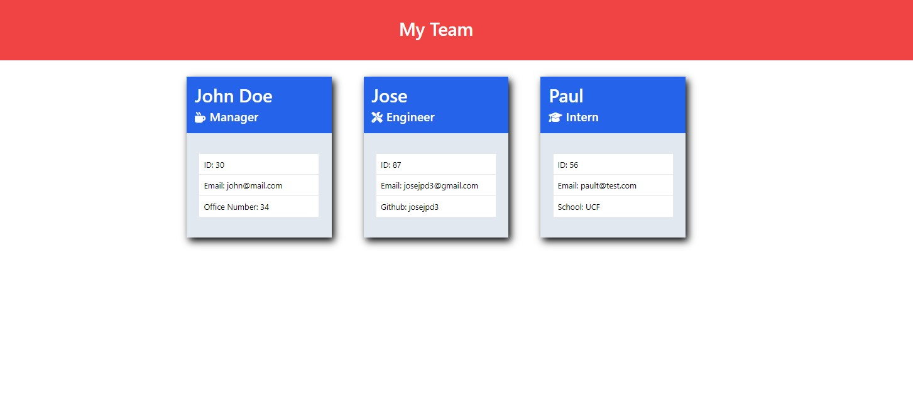

# 10-Module-Challenge

### Object-Oriented Programming Challenge: Team Profile Generator

---

## Team Profile Generator

The Team Profile Generator is an simple way to create your team and store information about each team member by answering a few questions about each member.

---

## Instructions [(Walk Through Video)](https://drive.google.com/file/d/1rZ2c32jrw2BuU1Xe4iiiTooaRzSynqSc/view) 

1. Clone down the repository
```
git clone git@github.com:Josejpd3/10-Module-Challenge.git
```
2. Enter in to **09-Module-Challenge** repo
```
cd 10-Module-Challenge
```
3. Install dependencies
```
npm i
```
4. Run the application
```
npm start
```
5. Answer the questions when prompted

After completing these steps your team.html file will be generated in this path *10-Module-Challenge/dist/team.html*.

## Demo


